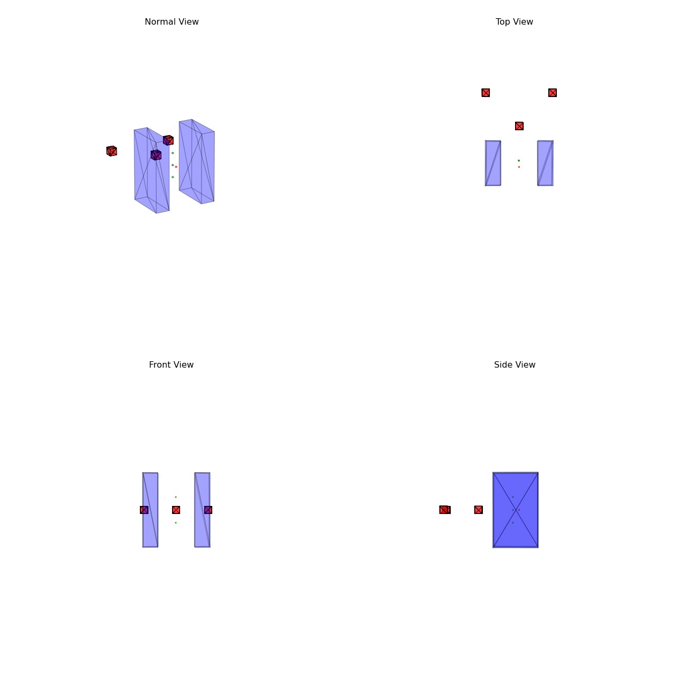

## Description

This is an implementation of formation navigation algorithm described in IROS 2015 paper "Multi-Robot Navigation in Formation Via Sequential Convex　Programming"

	Multi-Robot Navigation in Formation Via Sequential Convex Programming
	J. Alonso-Mora, S. Baker, and R. Siegwart
	IEEE/RSJ Int. Conf. on Intelligent Robots and Systems, 2015	

## Illustration

## Folder Structure

### src

	src/
	├── proto
	└── test

main test files are **UavTest.cpp** and **UavTest3D.cpp**.

### python

	python/
	├── examples
	│   ├── data
	│   └── gif
	└── irispy
    	├── __pycache__
    	└── test

- **python:** python scripts begin with 'vis' are for visualization
- **examples/data:** some formation navigation scenes(protocol buffer) I generated
- **examples/gif:** gif of the scenes in examples/data

## Requirements

Require environment of the followings'

- [IRIS](https://github.com/rdeits/iris-distro)
- [Drake](http://drake.mit.edu/)
- [Snopt](https://ccom.ucsd.edu/~optimizers/solvers/snopt/)
- [ORCA](http://gamma.cs.unc.edu/RVO2/)
- [Protocol Buffer](https://developers.google.com/protocol-buffers/)
- [Imagemagick](https://www.imagemagick.org/script/install-source.php)
- ...

## Example Usage

	mkdir build
	cd build
	cmake .. [-DV2D=ON]
	make
	bin/test/uavTest3D > log
	python python/vis3d_all_in_one.py
